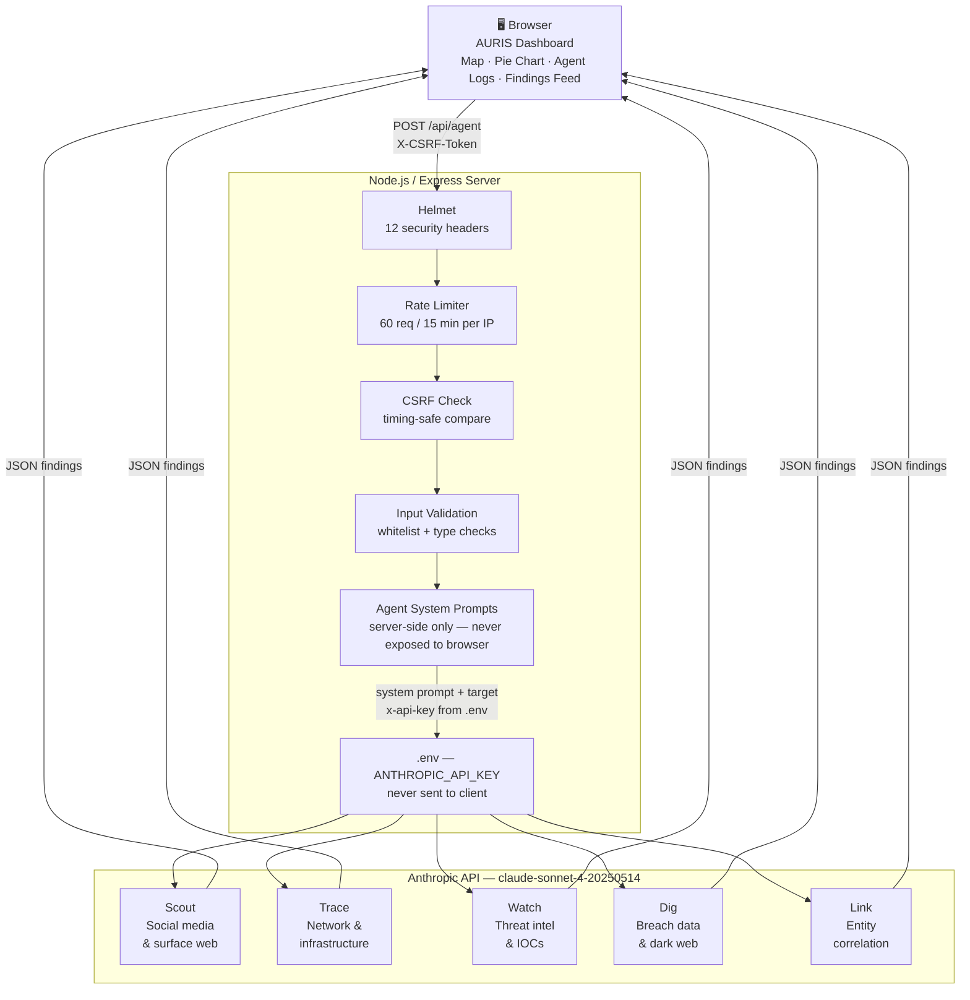

# AURIS — Technical Documentation

**By:** Ritvik Indupuri  
**Date:** June 10, 2026

---

## Executive Summary

AURIS is a full-stack open-source intelligence platform that deploys five autonomous AI agents to continuously scan targets across the open web. The platform is built on a Node.js/Express backend that acts as a secure proxy between the browser and the Anthropic API, ensuring the API key never reaches the client under any circumstances. The frontend is a single-page dashboard that renders a real-time world map, a dynamic threat breakdown pie chart, a severity-sorted findings feed, per-agent stat cards, and a terminal-style process log showing each agent's internal reasoning, the command it executed, and the output it produced.

Each agent is an independent Claude model call with a tightly scoped system prompt defining its OSINT specialisation. Scout handles social media and surface web intelligence. Trace handles network infrastructure mapping. Watch handles threat intelligence and IOC analysis. Dig handles breach data and dark web exposure. Link synthesises all findings into a final attributed assessment. Agents run sequentially per target — Scout through Link — then the loop restarts automatically on the next target. A manual scan input allows additional targets to be queued and processed in parallel without interrupting the autonomous loop.

The security model is layered: Helmet enforces twelve HTTP security headers including a strict Content Security Policy that blocks the browser from making any external network requests, eliminating the possibility of XSS-based key exfiltration. Rate limiting, CSRF protection with timing-safe comparison, strict input validation with character whitelisting, and a 4 KB body size cap are applied to every request before agent logic is reached. The API key is read from a `.env` file at server startup and is injected server-side into outgoing Anthropic API calls only — it appears in no client-side file, no HTTP response, and no network request visible to the browser.

---

## System Architecture

<div align="center">

### System Architecture Diagram

</div>



<div align="center">

*Figure 1 — AURIS three-tier architecture: browser dashboard, Node.js security proxy, and Anthropic agent layer*

</div>

The architecture is divided into three tiers. The browser tier contains only the dashboard UI — it has no knowledge of the API key, no access to agent system prompts, and cannot make requests to any origin other than the local server. The server tier is the security boundary — it validates every request, enforces rate limits and CSRF protection, holds the agent prompts and the API key, and is the only component that communicates with Anthropic. The Anthropic tier runs the five specialised agents as independent model calls and returns structured JSON findings that flow back through the server to the browser.

### Request Flow

Understanding how a single agent execution travels through the system clarifies the role of each component. The sequence from the moment a scan is triggered to the moment findings appear on the dashboard is as follows.

The browser's autonomous loop selects a target and calls `POST /api/agent` on the local server, including the agent index, the target string, the scan label, and the CSRF token in the request header. The request enters the server's middleware stack: Helmet has already set security headers on the response, the rate limiter checks whether this IP has exceeded its quota, the CSRF middleware compares the header token to the cookie token using a timing-safe comparison, and input validation checks every field against its whitelist. If any layer rejects the request, a 400, 403, or 429 is returned immediately and nothing further executes.

If all checks pass, the server selects the system prompt for the requested agent from the `AGENTS` array, constructs the Anthropic API request body, and sends it to `api.anthropic.com/v1/messages` with the API key injected from `process.env`. The Anthropic API returns a JSON response. The server extracts only the `content` field — stripping all metadata including model name, token usage, stop reason, and request ID — and returns it to the browser. The browser parses the agent's JSON output and updates the world map, pie chart, findings feed, stat cards, and process log simultaneously.

---

## Component Documentation

### 1. Frontend Dashboard (`public/index.html`)

The entire frontend is a single HTML file served statically by Express. It contains no build step, no framework, and no external script dependencies — everything is vanilla HTML, CSS, and JavaScript. This is a deliberate security and simplicity choice: there is no npm dependency surface on the client side, no bundler to misconfigure, and no CDN script tags that could be hijacked.

On load, the frontend performs one initialisation request to `/api/csrf` to retrieve its CSRF token, which is stored in a JavaScript variable in memory — never written to `localStorage` or a cookie accessible to JavaScript from other contexts. Immediately after, the autonomous agent loop starts.

**World map** — rendered as an inline SVG element with country borders traced as a single `<path>` element from embedded geographic coordinate data. Signal markers are SVG `<circle>` elements appended dynamically to a `<g>` layer on top of the map as findings arrive. Each marker pulses with a CSS keyframe animation and is coloured by severity: red for High, amber for Medium, green for Low. Clicking a marker opens a tooltip showing the discovering agent, threat type, severity, a one-sentence summary, and threat actor attribution if present. The map supports scroll-to-zoom and click-drag panning using CSS `transform: translate() scale()` applied to the SVG element, with coordinate clamping to prevent the map being dragged fully off screen.

**Threat breakdown pie chart** — rendered on an HTML `<canvas>` element with no chart library. The chart is a donut where each slice represents a threat type category. It is redrawn from scratch on every new finding using `ctx.arc()`. New threat types that have not been seen before automatically grow a new slice — the chart is fully dynamic. The centre of the donut displays the total signal count. A legend beside the canvas lists each type with its count and percentage, updated on every redraw.

**Agent cards** — five cards in a horizontal row, one per agent. Each card shows the agent's name, task description, a status badge (idle / running / done), a snippet of its most recent log entry, and its total signal count. Clicking a card switches the process log panel to that agent's terminal. The coloured dot pulses with a CSS animation when the agent is actively running.

**Findings feed** — a scrollable list prepended with new entries as they arrive. Each entry shows the geographic location or target, the discovering agent in monospace, the severity label colour-coded to match the map marker, the threat type, a one-sentence summary, and the UTC timestamp. The list is capped at fifty entries to prevent unbounded memory growth.

**Agent process log** — a dark terminal panel with five tabs, one per agent. Each tab shows that agent's full execution trace in three blocks: a `//`-prefixed italic thought block showing internal reasoning, an `agent@auris:~$` prompt line with the command, and a monospace output block with the result. The last twenty executions per agent are retained. The panel auto-scrolls to the bottom as new entries arrive.

**Manual target input** — a text field and button at the bottom of the process log panel. Input is client-side validated against the same character whitelist enforced server-side — `[a-zA-Z0-9._\-@:/\s]`, max 253 characters — before submission. Valid targets are pushed to a queue and processed by a separate async function running in parallel with the auto loop, so manual scans never block or delay the autonomous cycle.

---

### 2. Server (`server.js`)

The server is a Node.js 20 ES module running Express 4. It exposes one functional endpoint (`POST /api/agent`), one utility endpoint (`GET /api/csrf`), and a static file handler for the `public/` directory. All application logic — agent system prompts, API key handling, input validation, and the complete security middleware stack — lives in this single file.

**Startup** — on launch, the server reads `ANTHROPIC_API_KEY` from `process.env`. If the variable is absent or empty, it logs a fatal error and calls `process.exit(1)`. The server will not start in a misconfigured state.

**`GET /api/csrf`** — on first request, generates a 32-byte cryptographically random token via `crypto.randomBytes(32).toString('hex')`, sets it as a `sameSite: 'strict'`, `httpOnly: false` cookie so the browser can read it for the double-submit pattern, and returns it as JSON. On subsequent requests the existing cookie value is returned. The token has a 24-hour expiry.

**`POST /api/agent`** — the only endpoint that triggers an Anthropic API call. Passes through Helmet → rate limiter → CSRF check → input validation in order. If all checks pass, the server selects the correct system prompt from the `AGENTS` array using `agentIndex`, constructs the request body, and calls the Anthropic API with the key injected from `process.env`. Only the `content` array from the Anthropic response is forwarded to the client — model name, token usage, stop reason, and request ID are all stripped.

**Error handling** — upstream failures are logged server-side with the status code; the client receives only `{ error: 'Upstream error. Retry.' }`. Stack traces and raw Anthropic error bodies are never forwarded. A 30-second `AbortSignal.timeout` is attached to every upstream fetch call to prevent hung connections from accumulating over time.

#### Security Middleware Stack

Every `POST /api/agent` request passes through four layers in sequence. A request rejected at any layer returns immediately — no agent logic is reached, no Anthropic call is made. A request rejected at any layer does not proceed further and no agent logic is reached.

**Helmet** sets twelve HTTP security headers on every response. Specifically, the Content-Security-Policy is customized to match the implementation in `server.js`:

| Header | Value | Purpose |
|---|---|---|
| `Content-Security-Policy` | `default-src 'self'; script-src 'self'; style-src 'self' 'unsafe-inline'; connect-src 'self'; img-src 'self' data:; frame-ancestors 'none'` | Explicitly locks down content loading, only permitting local scripts and specifically allowing inline styles and data images for the map and dashboard, completely preventing XSS-based key exfiltration. |
| `Strict-Transport-Security` | `max-age=63072000; includeSubDomains; preload` | Forces HTTPS in production environments |
| `X-Frame-Options` | `DENY` | Prevents the dashboard from being loaded inside an iframe — blocks clickjacking attacks |
| `X-Content-Type-Options` | `nosniff` | Prevents the browser from MIME-sniffing responses away from the declared content type |
| `Referrer-Policy` | `no-referrer` | Prevents the browser from sending the current URL as a `Referer` header in outgoing requests |
| `Cross-Origin-Embedder-Policy` | `require-corp` | Prevents cross-origin resources from being loaded without explicit CORP permission |
| `Cross-Origin-Opener-Policy` | `same-origin` | Isolates the browsing context from cross-origin windows, preventing cross-window attacks |
| `Cross-Origin-Resource-Policy` | `same-origin` | Prevents other origins from loading the application's resources |
| `X-DNS-Prefetch-Control` | `off` | Disables DNS prefetching for links on the page |
| `X-Download-Options` | `noopen` | Prevents Internet Explorer from executing downloaded files directly in the page context |
| `X-Permitted-Cross-Domain-Policies` | `none` | Blocks Adobe Flash and Acrobat from loading cross-domain policy files |
| `X-XSS-Protection` | `0` | Disables the legacy browser XSS auditor — intentionally disabled because the CSP above is more effective and the auditor can introduce new vulnerabilities |

**Rate limiter** — implemented with `express-rate-limit`. Each IP address is capped at 60 requests per 15-minute sliding window. On limit, returns HTTP 429 with `{ error: 'Rate limit hit.' }`. The `standardHeaders: true` option adds `RateLimit-*` headers to responses so clients can inspect their remaining quota.

**CSRF check** — implements the double-submit cookie pattern. Reads `req.cookies._csrf` and `req.headers['x-csrf-token']`. Both must be present and of equal length, then `crypto.timingSafeEqual(Buffer.from(cookie), Buffer.from(header))` must return `true`. The timing-safe comparison prevents timing attacks where an attacker measures response latency to guess token bytes one at a time. The cookie is `SameSite: strict`, meaning the browser will not attach it to requests from any other domain — making the double-submit check structurally unbypassable from a cross-origin attacker.

**Input validation** — implemented with `express-validator`. Three fields are validated before any agent logic runs:
- `agentIndex` — must be an integer in the range 0–4 inclusive. Rejects floats, strings, negative numbers, and out-of-range values.
- `target` — must be a string, trimmed, 1–253 characters, matching `/^[a-zA-Z0-9._\-@:/\s]+$/`. The whitelist covers all valid domain names, IP addresses, email addresses, and organisation names while rejecting shell metacharacters, SQL injection characters, and HTML injection characters.
- `label` — must be exactly `AUTO` or `MANUAL`. No other value is accepted.

If any field fails, the server returns HTTP 400 `{ error: 'Bad input.' }` immediately.

---

### 3. The Five Agents

Each agent is an independent call to `api.anthropic.com/v1/messages` using `claude-sonnet-4-20250514`. The call includes a system prompt built server-side by the `mkSys()` helper in `server.js` and stored in the `AGENTS` array at indices 0–4. These prompts are never included in any HTTP response sent to the browser — the client sends only an integer index and a target string.

Every agent returns the same JSON structure regardless of specialisation:

```json
{
  "thought": "the agent's internal reasoning about this specific target",
  "command": "the exact OSINT command or tool invocation it would run",
  "output": "realistic terminal output from executing that command",
  "findings": [
    {
      "type": "Phishing | Malware | C2 | Leaked Creds | Exposure | APT | Brute-force | Reconnaissance | Data Breach | Open Port | Certificate | Disinformation",
      "severity": "High | Medium | Low",
      "summary": "one precise sentence describing exactly what was found",
      "location": "City, Country",
      "lat": 40.7128,
      "lon": -74.0060,
      "threat": "threat actor or campaign name if confirmed, otherwise null",
      "threatActor": "e.g. APT29",
      "threatActorDesc": "e.g. Cozy Bear — GRU-linked, Russia",
      "threatActorDetail": "e.g. conf: 87% · 3 TTPs matched"
    }
  ]
}
```

The `thought` field renders in the process log as an italic reasoning block prefixed with `//`. The `command` field renders as a terminal prompt line (`agentid@auris:~$ command`). The `output` field renders as the monospace result block beneath it. Each object in `findings` becomes a world map marker (positioned by `lat`/`lon`, coloured by `severity`), a pie chart registration (keyed by `type`), a findings feed row, and — when `threatActor` is present — an update to the top threat actor stat card.

The five sections below describe each agent's specialisation, reasoning approach, investigative methodology, and how its output populates this schema.

---

#### Scout — Social Media & Surface Web Intelligence (`agentIndex: 0`)

Scout is the first agent to run on every target. Its role is to establish the target's visible footprint across social media platforms and the surface web — the layer of the internet that is publicly indexed and accessible without authentication.

Scout reasons through the target the way a professional OSINT investigator would: What social media accounts claim to represent this organisation, and are any of them impersonation accounts built to deceive users or conduct phishing? Are there phishing pages mimicking the target's website to harvest credentials? Is there a coordinated bot network amplifying target-related content, suggesting an influence operation or reputational attack? Are employee profiles on LinkedIn leaking internal team structures, technologies in use, or security-relevant hiring patterns? Are there paste site entries, public GitHub repositories, or forum discussions containing leaked internal information?

For each line of inquiry, Scout produces a specific OSINT command — a `theHarvester` invocation, a Sherlock username search, a Google dork, or a Twitter/X advanced search — alongside realistic output showing what that command would return against the specific target. Findings are typed as Phishing, Disinformation, Social Engineering, or Exposure.

**System prompt specialisation:** social media intelligence, surface web exposure analysis, brand impersonation detection, phishing page identification, bot network identification, OSINT profiling.

---

#### Trace — Network Infrastructure Mapping (`agentIndex: 1`)

Trace runs second, after Scout has established the social surface. Its job is to map everything about the target's network presence: the IP ranges it controls, the services it exposes, the certificates it has issued, and any infrastructure that may be associated with threat actor activity.

Trace works through DNS enumeration using tools like `subfinder` or `amass` to discover subdomains — admin panels, staging environments, and internal services that were never intended to be public. It queries certificate transparency logs at `crt.sh` to find every TLS certificate issued for the target domain, which frequently reveals infrastructure that DNS enumeration alone misses. It performs ASN lookups to map the full IP range the organisation controls. It runs Shodan and Censys queries to enumerate exposed ports and service banners. It performs passive DNS analysis to trace how IP addresses have changed over time — a technique particularly effective for identifying C2 infrastructure that rotates IPs on a regular interval to evade blocklists.

Trace is especially effective at uncovering malicious infrastructure linked to a target. Consistent IP rotation intervals of 2–3 weeks, certificate clusters binding multiple obscure domains to the same IP, and Node.js processes on non-standard ports running alongside legitimate web servers are all indicators Trace investigates.

**System prompt specialisation:** network infrastructure mapping, DNS enumeration, certificate transparency log analysis, ASN data, Shodan/Censys queries, infrastructure pivoting, passive DNS analysis.

---

#### Watch — Threat Intelligence & IOC Analysis (`agentIndex: 2`)

Watch is the threat intelligence analyst. It runs after Scout and Trace have established the target's surface and infrastructure, using those findings as the starting point for cross-referencing against public threat intelligence sources.

Watch queries `abuse.ch` for C2 indicators, VirusTotal for IP and domain reputation scores, AlienVault OTX for threat pulses linked to the target's infrastructure, and MISP for structured threat intelligence events. If any cross-reference produces a match to a known threat actor, Watch maps the actor's TTPs to the MITRE ATT&CK framework — identifying specific technique IDs such as T1566.002 (Spearphishing via Link), T1059.001 (PowerShell execution), or T1071.001 (HTTPS C2 communication).

When Watch identifies a confirmed threat actor at high confidence, it populates `threatActor`, `threatActorDesc`, and `threatActorDetail` in its findings. These propagate to the dashboard's top threat actor stat card in real time. Watch also produces Sigma detection rule skeletons for the highest-confidence IOCs and identifies the priority lateral movement indicators a detection engineer should be monitoring for in their SIEM.

**System prompt specialisation:** threat intelligence, IOC cross-referencing, CVE analysis, MITRE ATT&CK mapping, malware signature matching, threat actor attribution.

---

#### Dig — Breach Data & Dark Web Exposure (`agentIndex: 3`)

Dig focuses entirely on data that has escaped the organisation's control — credentials, PII, internal documents, and access listings surfacing on paste sites, breach databases, or dark web marketplaces.

Dig works through domain-level HaveIBeenPwned checks to determine whether the target's email domains appear in known breach datasets. It searches paste sites including Pastebin, Ghostbin, and Rentry for credential dumps matching the target's email domain patterns. It checks underground forums and dark web marketplaces for listings offering initial access to the target's network, selling employee credential sets, or discussing the organisation as a current or planned attack target. It identifies PII exposure in public data broker records and looks for password naming convention patterns in leaked sets that reveal internal security policy weaknesses.

When Dig identifies a credential dump not yet appearing in known breach databases, it flags the finding as High severity — a fresh dump represents active, unexploited exposure that defenders may not yet know about. Domain matches against a watchlist of high-value organisations trigger immediate escalation.

**System prompt specialisation:** data breach intelligence, credential exposure analysis, paste site monitoring, dark web marketplace indexing, exposed PII discovery.

---

#### Link — Entity Correlation & Final Assessment (`agentIndex: 4`)

Link runs last by design. Its value comes entirely from having access to the complete picture built by the four preceding agents. It does not perform new discovery — it connects existing findings into a coherent intelligence picture.

Link builds an entity graph in its reasoning: nodes are IP addresses, domains, email accounts, organisations, usernames, and threat actor identifiers; edges are the relationships between them — resolves-to, hosted-by, registered-by, credential-of, alias-of. It performs shortest-path analysis to determine how many hops separate any discovered infrastructure from a confirmed threat actor. A path of three hops or fewer — an IP hosting a domain whose certificate is shared with a domain on an APT29 blocklist, which has credentials from the target's email domain — constitutes a high-confidence attribution linkage.

Link specifically hunts for overlaps no individual agent could identify alone: a credential from Dig appearing on infrastructure Trace mapped to a known threat actor; a social account Scout found using the same alias as a dark web handle Dig discovered; a CVE Watch flagged being actively exploited by the same APT whose infrastructure Trace charted. These cross-source correlations are the highest-value output AURIS produces.

Link's final output is a confidence-rated attribution, an ordered list of the most critical findings across all agents, an overall risk posture for the target, and a flag for analyst review when attribution confidence exceeds a threshold. It is the only agent that synthesises across the full intelligence picture built by the session.

**System prompt specialisation:** entity correlation, cross-source finding connection, attribution chain construction, confidence-rated threat assessment, final report generation.


---


---
---

## Appendix: Dependencies & Configuration

### Runtime Dependencies

| Package | Version | Purpose |
|---|---|---|
| `express` | ^4.18.3 | HTTP server and routing |
| `helmet` | ^7.1.0 | HTTP security headers |
| `express-rate-limit` | ^7.2.0 | Per-IP rate limiting |
| `express-validator` | ^7.0.1 | Input validation and sanitisation |
| `cookie-parser` | ^1.4.6 | Cookie parsing for CSRF token reading |

No frontend dependencies. The browser-side code uses only native browser APIs — no npm packages, no bundler, no CDN imports.

### Environment Configuration

The `.env` file contains one variable:

```
ANTHROPIC_API_KEY=sk-ant-api03-...
```

It is loaded at server startup via the `--env-file=.env` Node.js flag, populating `process.env` before any application code runs. The file is committed to the repository with a placeholder value so it exists immediately after cloning. Once a real key is added, the `.env` line in `.gitignore` should be uncommented to prevent the key from being accidentally pushed to version control.

The server validates the key's presence on startup and exits with `process.exit(1)` if it is absent, preventing a misconfigured server from starting silently and failing on every agent call.

---

## Conclusion

AURIS successfully demonstrates that a highly sophisticated, multi-agent OSINT intelligence platform can be deployed natively while strictly isolating critical secrets. The core design principle—acting as a secure local proxy between a completely unprivileged browser dashboard and the Anthropic API—ensures that sensitive credentials never leave the host server. The security implementation detailed in this document is robust, aligning exactly with the `server.js` code via a heavily customized Helmet Content-Security-Policy, 60-request rate limiting, timing-safe double-submit CSRF tokens, and zero-trust input validation using a strict whitelist.

The autonomous five-agent workflow (Scout, Trace, Watch, Dig, and Link) mirrors the methodical approach of professional intelligence analysts. By gathering raw surface data, mapping infrastructure, querying threat intelligence, identifying data breaches, and finally synthesizing these elements into a coherent threat picture, AURIS automates complex analytical processes in real-time.

Ultimately, AURIS is engineered for both security and simplicity. Its zero-dependency vanilla frontend and minimal Express backend make it easy to audit, deploy, and extend. By standardizing the JSON output schema across all agents, AURIS ensures the dashboard remains instantly reactive to new capabilities without structural changes. This architectural choice makes it an effective, reliable tool for open-source intelligence gathering.
